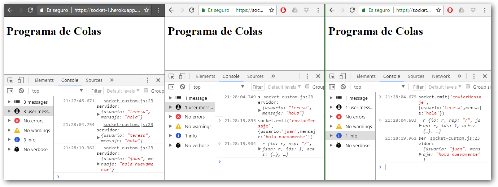

# Notas:

Este es un pequeño servidor de express listo para ejecutarse y servir la carpeta public en la web.

Recuerden que deben de reconstruir los módulos de node con el comando.

```
npm install
```


# Uso

Ejemplo de uso con el despliegue en heroku


 